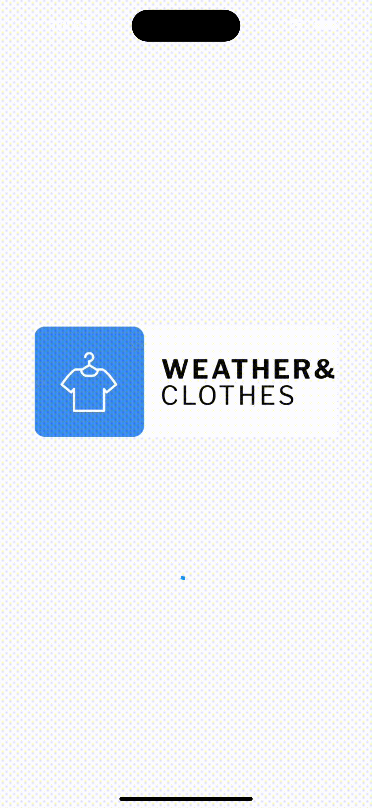
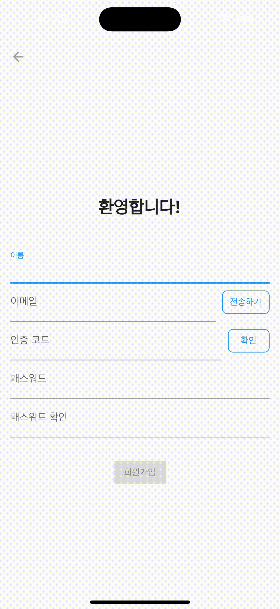
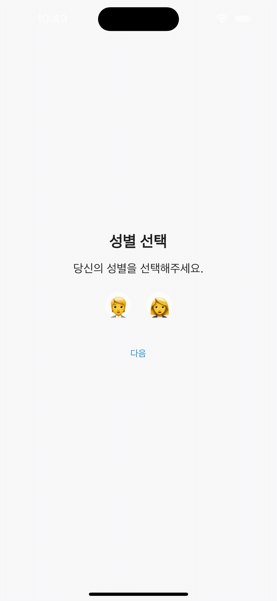

# 오늘 뭐 입지?

**Today Clothes**

기온과 개인 일정에 맞춘 AI 옷 추천 서비스

  <a href="https://seat-choice.notion.site/d764a0c49d364c349e5cd35da124364c">Notion</a>
  &nbsp; | &nbsp; 
  <a href="https://drive.google.com/file/d/17s_BNsqvs_Oc18t9mrA4Z1vg6UThx9Ol/view?usp=sharing/">발표 자료</a>

 

🤖 **날씨, 일정, 스타일**을 고려하여 AI가 옷을 추천해드려요.

👕 추천 받은 상·하의를 **자신의 스타일에 맞게 조합**하고 저장할 수 있어요.

❤ 추천 받은 상·하의 각각을 **좋아요**를 누르고 확인할 수 있어요.

 

## 기술스택

&nbsp;
&nbsp;
&nbsp;
&nbsp;
&nbsp;
&nbsp;
&nbsp;
&nbsp;
&nbsp;
&nbsp;
&nbsp;
&nbsp;
 

 

## Architecture

## ERD

## Demonstration

### 🙌 Intro
> 이메일 인증을 통해 회원 가입을 진행해요.
> 
> 카카오, 네이버로도 간편하게 로그인할 수 있어요.
> 
> 정확한 AI 서비스를 위해 성별과 지역을 입력 받아요.

<table align=center>
  <tr>
    <td>
      
    </td>
    <td>
      
    </td>
    <td>
      
    </td>
  </tr>
  <tr>
    <td>
      
intro

    </td>
    <td>
      
이메일 인증 및 회원가입

    </td>
    <td>
      
성별 및 지역 선택

    </td>
  </tr>
</table>

### ⭐ 주요 기능
> 오늘, 내일, 모레의 날씨를 확인하고 일정을 입력할 수 있어요.
>
> 날씨, 일정 그리고 회원 정보에 맞게 옷을 추천해드려요.
> 
> 추천 받은 옷을 스와이프하여 조합하여 저장하고 확인할 수 있어요.
>
> 회원이 저장한 옷을 통해 개인화된 추천 알고리즘이 적용돼요.
>
> 상·하의에 좋아요를 누르고 확인할 수 있어요.

<table align=center>
  <tr>
    <td>
      
    </td>
    <td>
      
    </td>
  </tr>
  <tr>
    <td>
      
일정과 날씨에 맞게 추천된 옷 조합 저장

    </td>
    <td>
      
저장한 옷 조합 및 좋아요 누른 상·하의 조회

    </td>
  </tr>
</table>

### 👫 성별에 따라 다른 의류 추천
> 남자 회원은 무신사에서 판매되는 옷을 추천드려요.
>
> 여자 회원은 브랜디에서 판매되는 옷을 추천드려요.

<table align=center>
  <tr>
    <td>
      
    </td>
    <td>
      
    </td>
  </tr>
  <tr>
    <td>
      
남자 회원 (musinsa 크롤링)

    </td>
    <td>
      
여자 회원 (brandi 크롤링)

    </td>
  </tr>
</table>

 

## created by

<table>
  <tr>
    <td>
      
    </td>
    <td>
      
    </td>
    <td>
      
    </td>
  </tr>
  <tr>
    <td align=center>
      <a href="https://github.com/reeruryu">@reeruryu</a>
    </td>
    <td align=center>
      <a href="https://github.com/dmdwn99">@dmdwn99</a>
    </td>
    <td align=center>
      <a href="https://github.com/LEESEUNGRYEOL">@LEESEUNGRYEOL</a>
    </td>
  </tr>
</table>

